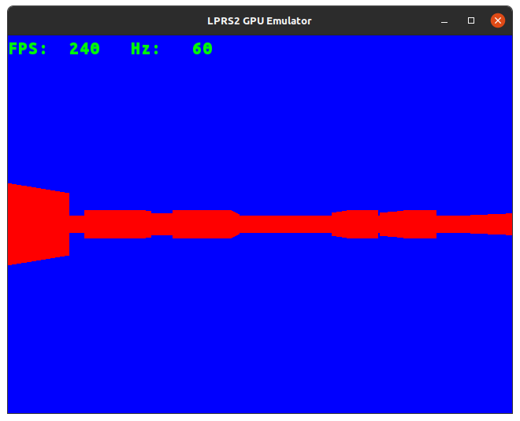
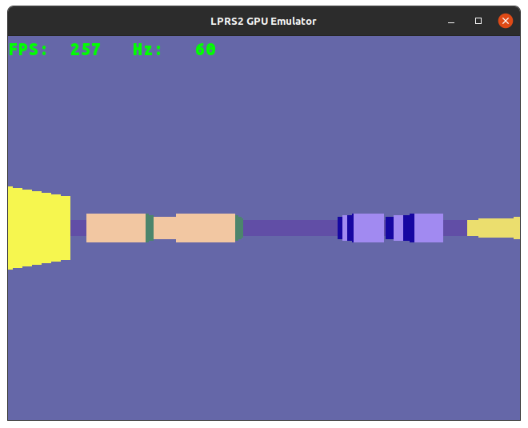
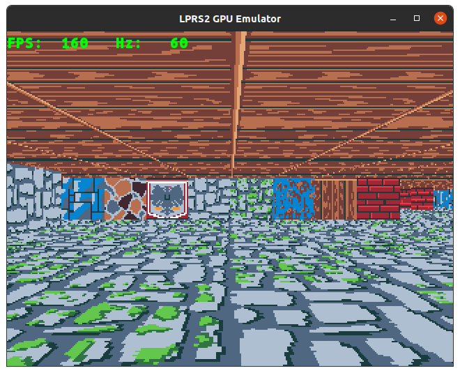
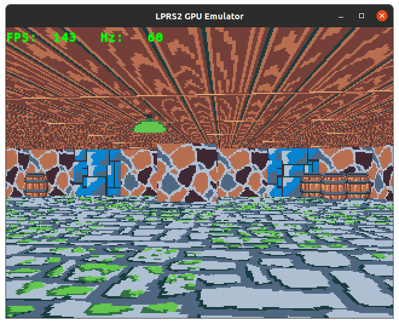
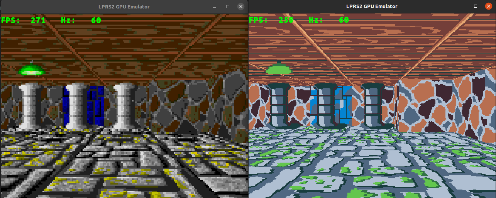
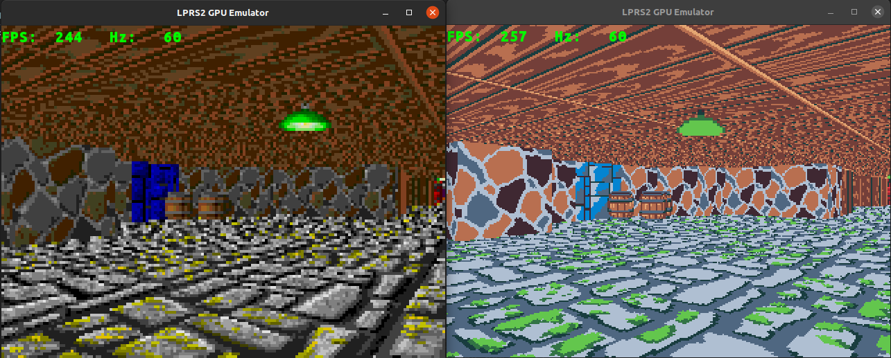

# LPRS2 Emulator
Grupni projekat iz predmeta LPRS2. 

**Autori**: *Marko Đorđević, Radomir Zlatković, Aleksa Heler*

## Sadržaj
- [Uvod](#uvod)
- [Koncept](#koncept)
- [Timeline](#timeline)
- [Pokretanje](#pokretanje)
- [Proof of concept](#poc)
  - [POC 1 - 2 color rendering](#poc1)
  - [POC 2 - 16 color rendering](#poc2)
  - [POC 3 - textured walls](#poc3)
  - [POC 4 - floor and ceiling](#poc4)
  - [POC 5 - sprites](#poc5)
  - [POC 6 - rgb333 vs idx4](#rgb)
- [Struktura projekta](#struktura)
- [Igrica](#igrica)

## Uvod <a name = "uvod"></a>
[TODO]

## Koncept <a name = "koncept"></a>
Ideja je bila napraviti igricu za emulator koja je slična [Wolfenstein 3D](https://en.wikipedia.org/wiki/Wolfenstein_3D). Kako bi mogli napraviti 3D igru u 2D emulatoru, koristimo Raycasting algoritam (ne raytracing). Kako bi pojednostavili sebi problem, i kako nije neophodno imati vertikalnost u igri (spratovi, stepenice, skokovi), možemo mapu predstaviti 2D matricom celih brojeva, gde broj označava tip zida, i ako je 0 znači prazno polje po kojem se igrač može kretati.

Kako bismo dobili 3D efekat, potrebno je zidove nacrtati tako da im je visina obrnuto proporcionalna udaljenosti od kamere. To radimo tako što crtamo jednu po jednu vertikalnu liniju. Za svaku vertikalnu liniju bacimo zrak u tom smeru i gledamo kad ce udariti u prvi zid i time dobijemo udaljenost, i za to koristimo relativno jednostavan "**Digital Differential Analysis**" ([DDA](https://en.wikipedia.org/wiki/Digital_differential_analyzer_(graphics_algorithm))) algoritam.

DDA je relativno brz i koristi se za pretragu koje kvadrate zrak (ray) pogađa. Mi ga koristimo da nađemo koji kvadrat naše mape je zrak pogodio i zaustavimo algoritam u tom trenutku i nacrtamo vertikalnu liniju čija visina odgovara udaljenosti zida tj. dužini zraka. Ideju za ovaj algoritam nam je dao [Lode Vandevenne](https://lodev.org/), i deo implementacije je odrađen po njegovom [tutorijalu](https://lodev.org/cgtutor/raycasting.html).

## Timeline <a name = "timeline"></a>
- [X] Proof of concept
  - [X] Render bez tekstura sa dve boje (1bit color indexing)
  - [X] Render bez tekstura sa više boja (4bit color indexing)
  - [X] Render sa teksturama (učitavanje iz fajla)
  - [X] Render sa podom i plafonom
  - [X] Render sa sprajtovima (bure, stub, lampa)
- [ ] Engine
  - [ ] *Renderer*
    - [X] Pomeriti sve u svoje funkcije i fajlove i sredjivanje koda (**Aleksa**)
    - [X] Sort funkcija za sprite-ove kako bi bili jedni ispred drugih kad se renderuju (**Radomir**)
    - [ ] Particle system: samo renderovati sitne pravougaonike u world space-u. Hard code: stvori mi particle ovde ove boje i da bude samo jedan efekat kao eksplozija (kada pogodi neprijatelja npr) (**Marko**)
    - [ ] Animacija za sprajtove: apstrakcija da iz game code-a kazemo taj sprajt promeni u taj state (tako mozemo pucati i neprijatelj imati animacije)
    - [X] Sprite rendering: directly to world space 1:1 (**Aleksa**)
    - [X] Double buffering: da se ne racuna u toku vSync-a, vec u slobodno vreme i upisuje u drugi bafer i kad dodje vSync samo se kopira u pravi bafer za ekran (**Aleksa**)
    - [ ] Preci na packed mod indeksiranja (**Aleksa**)
    - [ ] Napraviti da player init vraca pokazivac na player strukturu i da se to prosledjuje dalje funkcijama, a ne da imamo samo globalnu kameru ili nesto tako - pomoci ce kasnije sa apstrakcijama (**Aleksa**)
    - [ ] (optional) Osvetljenje i dithering (bayer ordered dithering?)
    - [ ] (optional) Renderer funkcija se poziva maksimalno 60 puta u sekundi (moze i manje ali ne i vise) da se izbegne prevelik framerate i ubrzanje igrice
  - [ ] *Apstrakcija engine-a* (**Marko**)
  - [ ] *fmath.h*
    - [ ] preci na fixed point (**Marko**)
    - [X] floor, sin, cos - CORDIC algoritam (**Aleksa**)
    - [ ] abs, round (**Radomir**)
    - [ ] (optional) smooth ubrzanje za igraca
- [ ] Game
  - [ ] UI
    - [ ] Main menu: biranje nivoa i tezine (player/enemy damage)
  - [ ] Graphics design
    - [ ] Naci dobru paletu - 16 boja: 8 pravih boja ali svaka ima svoj taminiji duplikat
    - [ ] Naci dobre sprajtove za igru: teksture, sprajtovi, UI
  - [ ] Game mechanics
    - [ ] Imamo dva dugmeta: A i B. Na jedno se menja selekcija, na drugo se upotrebljava selektovano
    - [ ] oruzje (za pocetak samo jedno)
    - [ ] municija, smrt, taking damage
    - [ ] hp / lives
    - [ ] Consumable items / grenades
    - [ ] Igrac ima 'debljinu' da ne moze prici zidu beskonacno blizu
    - [ ] Player UI (nisan, municija, health)
    - [ ] (optional) Postoji kljuc na mapi koji treba da se pokupi i otkljuca vrata da se ode na naredni nivo/pobedi
    - [ ] Vezati brzinu kretanja za vreme, a ne FPS
  - [ ] Enemy - AI
    - [ ] Za pocetak samo jedan tip
    - [ ] Kako se krece (npr odrzava neku idealnu razdaljinu)
    - [ ] Puca ka igracu kad je u nekom dometu
    - [ ] Kako umire (animacija/nestaje/drop)
  - [ ] Apstrakcija nivoa
  - [ ] Development timelapse video

## Pokretanje <a name = "pokretanje"></a>

``` sudo ./waf prerequisites ``` - install waf prerequisites

``` sudo ./waf configure ``` - configure project

``` sudo ./waf build run --app=project ``` - run the app

## Proof of concept <a name = "poc"></a>

<details><summary>Click to expand</summary>

### proof_of_concept1.c <a name = "poc1"></a>
Koristi 1bit indeksiranje boja, dakle postoje dve boje (u našem slučaju plava 0 i crvena 1). Implementira jednostavno kretanje igrača (napred nazad, okretanje levo desno). Kod iscrtavanja na ekran, nakon što sačeka vSync signal, sve piksele postavi na plavo (pozadina = 0), i zatim prolazi kroz širinu ekrana, od levo ka desno i iscrtava linije odgovarajuće visine koristeći DDA algoritam i svaki zid oboji istom bojom. Mapa je zabeležena u kodu (hard coded) kao dvodimenzionalni niz tipa *int*.



### proof_of_concept2.c <a name = "poc2"></a>
Slično kao i prvi p.o.c. samo koristi 4bit indeksiranje za boje, i paletu definišemo na početku koda. Onda se kod iscrtavanja linije gleda koji je broj (tip) kvadrata na mapi pogođen i u zavisnosti od toga oboji liniju. Ostatak je u suštini isti. Može se primetitit da je u drugom p.o.c. rezolucija manja. To je zato što za indeksiranje koristimo više bitova, i sa istim ograničenjem memorije može da stane manje piksela, u ovom slučaju 4x manje, što je rezolucija 320x240 umesto 640x480.



### proof_of_concept3.c <a name = "poc3"></a>
Nastavak na drugi proof of concept, gde je dodato da se umesto jednobojne vertikalne linije crta linija koja se ucitava iz teksture.

 

### Proof of concept 4 <a name = "poc4"></a>
Nije prilozen kod za ovo, ali je dodatak na raycasting algoritam gde se na pocetku frejma iscrtaju plafon i pod.



### Proof of concept 5 <a name = "poc5"></a>
Dodati sprajtovi (bure, stub i lampa). Crtanje sprajtova se odvija nakon zidova i poda po sledećim koracima:
 1. Dok se zidovi raycast-uju, cuvamo udaljenosti svake vertikalne linije u 1D baferu (ZBuffer)
 2. Izracunamo udaljenost svakog sprajta od igrača
 3. Iskoristimo tu udaljenost od igrača da sortiramo sprajtove, od najdaljeg do najbližeg kameri
 4. Projektujemo sprajtove na ravan kamere (u 2D): oduzmemo poziciju igrača od pozicije sprajta i pomnožimo rezultat inverznom 2x2 matricom kamere
 5. Izračunamo veličinu sprajta na ekranu (u x i y smeru) koristeći udaljenost svake vertikalne linije iz tačke 1.
 6. Nacrtamo sprajtove jednu po jednu vertikalnu liniju, i ne crtamo linije gde je sprajt uddaljeniji od 1D ZBuffer-a koji govori da je zid između
 7. Nacrtamo vertikalnu liniju piksel po piksel, i obratimo pažnju da postoje 'nevidljive' boje (u našem slučaju 0xffffff) kako svi sprajtovi ne bi bili kockasti
Nije potrebno apdejtovati ZBuffer dok crtamo linije, kako su već sortirani sprajtovi, oni koji su bliži biće nacrtani poslednji.



### Proof of concept 6 <a name = "rgb"></a>
Ovde se postavlja pitanje da li vredi preći na RGB333 color space koji nudi vise boja i lakse upravljanje bojama, po cenu smanjenje rezolucije, ili zadržati IDX4 color space. Na slikama ispod se vidi primer razlike (levo RGB333, desno IDX4):



</details>

## Struktura projekta <a name = "struktura"></a>

**project.c** - glavni fajl, **main** funkcija, entry point

**device.h** - podaci o platformi: rezolucija ekrana, define-ovi, ucitavanje "system.h" fajla sa emulatorom

**engine.h** - strukture kamere i sprajta

**fmath.h** - nasa matematicka biblioteka: sin, cos, abs, floor, shift divide

**game_data.h** - mapa, skladistenje tekstura i sprajtova

**sprites_data.h** - pikseli sprajtova i tekstura

**player.h** - funkcije igraca: initialize i update

**raycast_renderer.h** - funkcije renderera: init, render, wait_for_vsync, cls, floor/wall/sprite_raycaster, transfer_buffer, dda

**sprites_renderer.h** - funkcije sprajtova: draw_sprite, sort_sprites (quick_sort, partition, swap)


## Igrica <a name = "igrica"></a>
